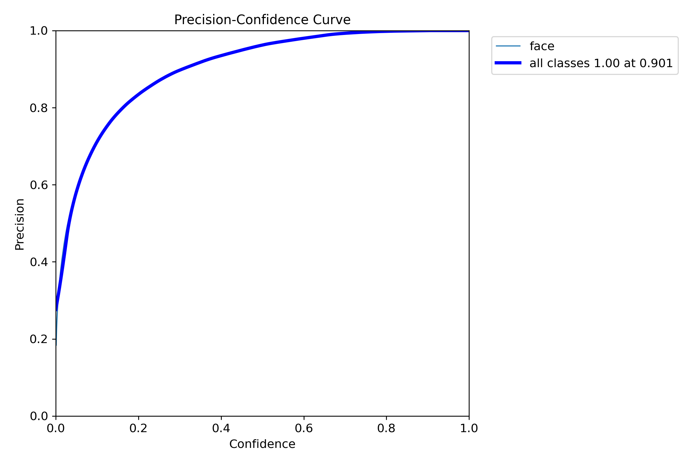

# YOLOv9

Implementation of paper - [YOLOv9: Learning What You Want to Learn Using Programmable Gradient Information](https://arxiv.org/abs/2402.13616)

[](https://huggingface.co/spaces/kadirnar/Yolov9)
[](https://huggingface.co/merve/yolov9)
[](https://colab.research.google.com/github/roboflow-ai/notebooks/blob/main/notebooks/train-yolov9-object-detection-on-custom-dataset.ipynb)
[](https://arxiv.org/abs/2402.13616)

<div align="center">
    <a href="./">
        
    </a>
</div>

## 🔥Update

- ✅ **YOLOv9-c (face) trained on WIDERFace [26.02]** 

## Installation

Docker environment (recommended)
<details><summary> <b>Expand</b> </summary>

``` shell
# create the docker container, you can change the share memory size if you have more.
nvidia-docker run --name yolov9 -it -v your_coco_path/:/coco/ -v your_code_path/:/yolov9 --shm-size=64g nvcr.io/nvidia/pytorch:21.11-py3

# apt install required packages
apt update
apt install -y zip htop screen libgl1-mesa-glx

# pip install required packages
pip install seaborn thop

# go to code folder
cd /yolov9
```

</details>

## Trained models

[`yolov9-c-face.pt`](https://github.com/akanametov/yolov9-face/releases/download/1.0/yolov9-c-face.pt)

# YOLOv9-face

## Results

PR curve:
<div align="center">
    <a href="./">
        
    </a>
    <a href="./">
        
    </a>
    <a href="./">
        
    </a>
</div>

Losses and mAP:
<div align="center">
    <a href="./">
        
    </a>
</div>

Confusion matrix:
<div align="center">
    <a href="./">
        
    </a>
</div>

## Training

Data preparation

* Download [dataset](http://shuoyang1213.me/WIDERFACE/):

* Download pretrained [yolov9-c.pt](https://github.com/WongKinYiu/yolov9/releases/download/v0.1/yolov9-c.pt) model.

Single GPU training

``` shell
# train model
python train_dual.py --workers 8 --device 0 --batch 12 --data data/widerface.yaml --img 640 --cfg models/detect/yolov9-c.yaml --weights 'yolov9-c.pt' --name yolov9-c --hyp hyp.scratch-high.yaml --min-items 0 --epochs 100 --close-mosaic 15
```

## Pretrained models

MS COCO

| Model | Test Size | AP<sup>val</sup> | AP<sub>50</sub><sup>val</sup> | AP<sub>75</sub><sup>val</sup> | Param. | FLOPs |
| :-- | :-: | :-: | :-: | :-: | :-: | :-: |
| [**YOLOv9-S**]() | 640 | **46.8%** | **63.4%** | **50.7%** | **7.2M** | **26.7G** |
| [**YOLOv9-M**]() | 640 | **51.4%** | **68.1%** | **56.1%** | **20.1M** | **76.8G** |
| [**YOLOv9-C**](https://github.com/WongKinYiu/yolov9/releases/download/v0.1/yolov9-c.pt) | 640 | **53.0%** | **70.2%** | **57.8%** | **25.5M** | **102.8G** |
| [**YOLOv9-E**](https://github.com/WongKinYiu/yolov9/releases/download/v0.1/yolov9-e.pt) | 640 | **55.6%** | **72.8%** | **60.6%** | **58.1M** | **192.5G** |

<!-- small and medium models will be released after the paper be accepted and published. -->

## Useful Links

<details><summary> <b>Expand</b> </summary>

Custom training: https://github.com/WongKinYiu/yolov9/issues/30#issuecomment-1960955297
    
ONNX export: https://github.com/WongKinYiu/yolov9/issues/2#issuecomment-1960519506 https://github.com/WongKinYiu/yolov9/issues/40#issue-2150697688

TensorRT inference: https://github.com/WongKinYiu/yolov9/issues/34#issue-2150393690 https://github.com/WongKinYiu/yolov9/issues/79#issue-2153547004

Hugging Face demo: https://github.com/WongKinYiu/yolov9/issues/45#issuecomment-1961496943

CoLab demo: https://github.com/WongKinYiu/yolov9/pull/18

ONNXSlim export: https://github.com/WongKinYiu/yolov9/pull/37

YOLOv9 ByteTrack: https://github.com/WongKinYiu/yolov9/issues/78#issue-2153512879

YOLOv9 counting: https://github.com/WongKinYiu/yolov9/issues/84#issue-2153904804

AnyLabeling tool: https://github.com/WongKinYiu/yolov9/issues/48#issue-2152139662

</details>


## Re-parameterization

See [reparameterization.ipynb](https://github.com/WongKinYiu/yolov9/blob/main/tools/reparameterization.ipynb).


## Citation

```
@article{wang2024yolov9,
  title={{YOLOv9}: Learning What You Want to Learn Using Programmable Gradient Information},
  author={Wang, Chien-Yao  and Liao, Hong-Yuan Mark},
  booktitle={arXiv preprint arXiv:2402.13616},
  year={2024}
}
```

```
@article{chang2023yolor,
  title={{YOLOR}-Based Multi-Task Learning},
  author={Chang, Hung-Shuo and Wang, Chien-Yao and Wang, Richard Robert and Chou, Gene and Liao, Hong-Yuan Mark},
  journal={arXiv preprint arXiv:2309.16921},
  year={2023}
}
```


## Teaser

Parts of code of [YOLOR-Based Multi-Task Learning](https://arxiv.org/abs/2309.16921) are released in the repository.


## Acknowledgements

<details><summary> <b>Expand</b> </summary>

* [https://github.com/AlexeyAB/darknet](https://github.com/AlexeyAB/darknet)
* [https://github.com/WongKinYiu/yolor](https://github.com/WongKinYiu/yolor)
* [https://github.com/WongKinYiu/yolov7](https://github.com/WongKinYiu/yolov7)
* [https://github.com/VDIGPKU/DynamicDet](https://github.com/VDIGPKU/DynamicDet)
* [https://github.com/DingXiaoH/RepVGG](https://github.com/DingXiaoH/RepVGG)
* [https://github.com/ultralytics/yolov5](https://github.com/ultralytics/yolov5)
* [https://github.com/meituan/YOLOv6](https://github.com/meituan/YOLOv6)

</details>
